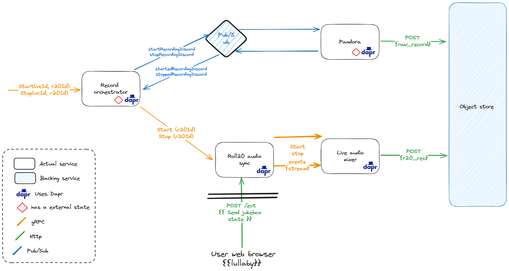

# Discord and Roll20 Recorder orchestrator


An [orchestration-based saga](https://learn.microsoft.com/en-us/azure/architecture/reference-architectures/saga/saga)
to record audio from Discord and Roll20 at the same time to be later mixed used in a podcast.

This orchestrator has the following responsibilities:
- Start and stop the recording of audio from Discord and/or Roll20
- Maintain the state of the recording

The orchestrator controls two main parts:
- The Discord recording system with [Pandora](https://github.com/SoTrxII/Pandora)
- The [Roll20 recording system](https://github.com/SoTrxII/roll20-audio-sync), with the syncer and live audio mixer



## Usage

The recorder uses a gRPC API. The proto file is available in the [proto](./proto) folder.

### Start recording

To start the recording, send a request to the `start` endpoint of the orchestrator service.

|Parameters| Description | Required |
|----------|-------------|----------|
|`voiceChannelId`| The ID of the Discord voice channel you want to record | Yes |
|`roll20GameId`| The ID of the Roll20 game you want to record | No |

You can find the ID of a Discord voice channel by enabling the developer mode in the Discord settings, right-clicking on the voice channel and selecting "Copy ID".

The ID of a Roll20 game is the number in the URL of the game. For example, if the URL of the game is `https://app.roll20.net/campaigns/details/1234/my-game`, the ID is `1234`.


```bash
grpcurl -plaintext -d '{"voiceChannelId": "your_channel_id", "roll20GameId": "your_game_id"}' localhost:50051 recorder.RecordService/Start
```

The response is an object containing which services are being recorded. For example, if both Discord and Roll20 are being recorded, the response will be: 
```json
 {"discord": true, "roll20": true}
```

### Stop recording

To stop the recording, send a request to the `stop` endpoint of the orchestrator service. This has the same parameters as the `start` endpoint.

|Parameters| Description | Required |
|----------|-------------|----------|
|`voiceChannelId`| The ID of the Discord voice channel you want to record | Yes |
|`roll20GameId`| The ID of the Roll20 game you want to record | No |

```bash
grpcurl -plaintext -d '{"voiceChannelId": "your_channel_id", "roll20GameId": "your_game_id"}' localhost:50051 recorder.RecordService/Stop
```

The response will contain the key that can be used to retrieve the recordings from the object store.

```json
{"discordKeys": ["discord_key1", "discord_key2"], "roll20Key": "roll20_key"}
```

## Setting up the project locally

Pre-requisites:
- [Docker](https://docs.docker.com/get-docker/)
- [Dapr](https://dapr.io/) >= 1.12, initialized in self-hosted mode
- [Go](https://golang.org/) >= 1.19
- [Node.js](https://nodejs.org/en/) >= 20.0.0

The following backing services are required:
- A state storage solution. Redis is used, as it comes with Dapr by default.
- A pubsub solution. Redis is used, as it comes with Dapr by default.
- An object store. Minio is used here, as its close to the S3 API. A minio container will be started a bit further down.

To start the project, clone the projects repositories:

```bash
git clone 
```

```bash
# Start the backing services
./deploy/start-dependencies.sh
# Start the orchestrator
dapr run -f ./deploy/recorder.yaml
```


## Configuration

The orchestrator uses the following environment variables:

| Name | Description                                                                                            | Default |
|------|--------------------------------------------------------------------------------------------------------|---|
|`SERVER_PORT`| Port used for the orchestrator gRPC server                                                             |`55555` |
|`DAPR_GRPC_PORT`| Port used by the dapr sidecar. Automatically provided on proper deployments                            |`50001` |
|`PUBSUB_NAME`| Dapr component name for the pubsub component                                                           |`pubsub` |
|`ROLL20_NAME`| Dapr app-id for the [roll20 recorder](https://github.com/SoTrxII/roll20-audio-sync) service invocation |`roll20-audio-sync` |
|`STORE_NAME`| Dapr component name for the state store                                                                |`statestore` |


